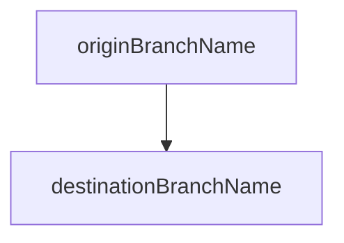

# New Release MR

## What does this MR do?

- Bring changes from one branch to another:

## Author's checklist

- [ ] Apply the correct label ~Release.
- [ ] Change the release date in CHANGELOG or create the new entry if applies.
- [ ] Check this is a conflict-free MR.

## Review checklist

- [ ] PM's review (required)

Thanks for your MR, you're awesome :+1:

/label ~Release